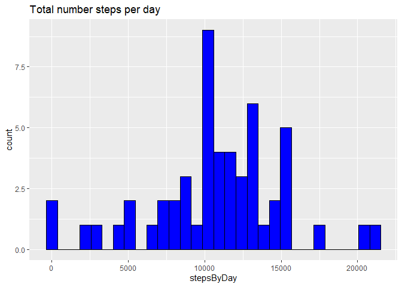
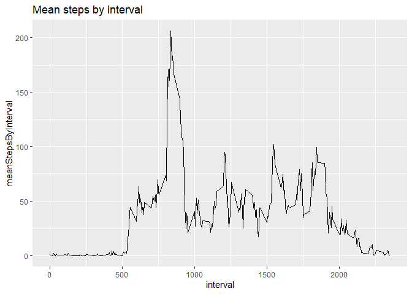
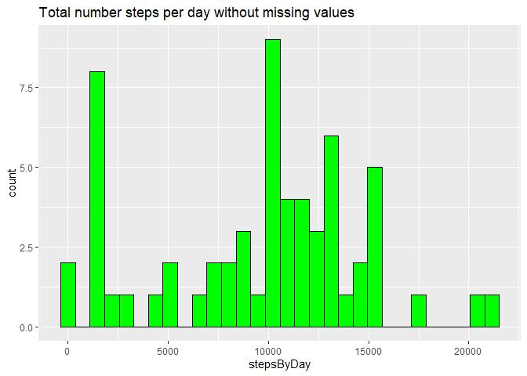
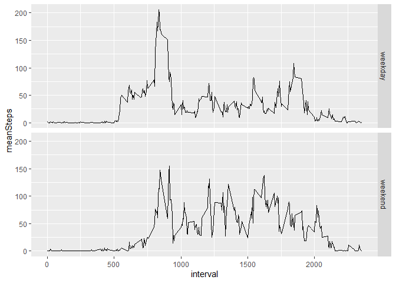

# Solution

## Loading and preprocessing the data

1. Download and read the raw data


```r
download.file(url="https://d396qusza40orc.cloudfront.net/repdata%2Fdata%2Factivity.zip", destfile = "rawdata.zip")

unzip("rawdata.zip")

originalData<-read.csv(file="activity.csv")

str(originalData)
```

```
## 'data.frame':	17568 obs. of  3 variables:
##  $ steps   : int  NA NA NA NA NA NA NA NA NA NA ...
##  $ date    : chr  "2012-10-01" "2012-10-01" "2012-10-01" "2012-10-01" ...
##  $ interval: int  0 5 10 15 20 25 30 35 40 45 ...
```

2. Dates from String to Date and removing records without steps info 


```r
data<-originalData%>%filter(!is.na(steps))%>%
  mutate(date=as.Date(date, "%Y-%m-%d"))

str(data)
```

```
## 'data.frame':	15264 obs. of  3 variables:
##  $ steps   : int  0 0 0 0 0 0 0 0 0 0 ...
##  $ date    : Date, format: "2012-10-02" "2012-10-02" ...
##  $ interval: int  0 5 10 15 20 25 30 35 40 45 ...
```
## What is mean total number of steps taken per day?

1. Histogram with the total number of steps taken per day


```r
stepsByDayDataFrame<-data%>%group_by(date)%>%summarize(stepsByDay=sum(steps))

ggplot(stepsByDayDataFrame, aes(x=stepsByDay))+
  geom_histogram(bins=30, color="black", fill="blue")+
  ggtitle("Total number steps per day")
```

<!-- -->

2. mean and median of the total number of steps taken per day

```r
stepByDayMean = mean(stepsByDayDataFrame$stepsByDay)

stepByDayMean
```

```
## [1] 10766.19
```

```r
stepByDayMedian = median(stepsByDayDataFrame$stepsByDay)

stepByDayMedian
```

```
## [1] 10765
```

The mean for the number of steps taken per day is : 10766.1886792453

The median for the number of steps taken per day is : 10765

## What is the average daily activity pattern?

1. Make a time series plot (i.e. \color{red}{\verb|type = "l"|}type = "l") of the 5-minute interval (x-axis) and the average number of steps taken, averaged across all days (y-axis)


```r
meanStepsByIntervalDataFrame<-data%>%group_by(interval)%>%
   summarise(meanStepsByInterval=mean(steps))

ggplot(meanStepsByIntervalDataFrame, aes(x=interval, y=meanStepsByInterval)) +
  geom_line() + ggtitle("Mean steps by interval ")
```

<!-- -->

2. Which 5-minute interval, on average across all the days in the dataset, contains the maximum number of steps?


```r
interval<-meanStepsByIntervalDataFrame%>%
  filter(meanStepsByInterval==max(meanStepsByInterval))%>%
  select(interval)
```
The interval with maximum steps is : 835


## Imputing missing values

1. Calculate and report the total number of missing values in the dataset (i.e. the total number of rows with NAs)


```r
anyNA(originalData$date)
```

```
## [1] FALSE
```

```r
anyNA(originalData$interval)
```

```
## [1] FALSE
```

```r
anyNA(originalData$steps)
```

```
## [1] TRUE
```

```r
totalMissingValues<-sum(is.na(originalData$steps))
```

The total number of missing values in the original dataset is 2304

2. Devise a strategy for filling in all of the missing values in the dataset. The strategy does not need to be sophisticated. For example, you could use the mean/median for that day, or the mean for that 5-minute interval, etc.

I decided replace the NA values with the median per interval.


3. Create a new dataset that is equal to the original dataset but with the missing data filled in.


```r
originalDataWithoutNAValues<-originalData%>%group_by(interval)%>%
  mutate(steps= ifelse(!is.na(steps),steps,median(steps, na.rm = TRUE)))

originalDataWithoutNAValues
```

```
## # A tibble: 17,568 × 3
## # Groups:   interval [288]
##    steps date       interval
##    <int> <chr>         <int>
##  1     0 2012-10-01        0
##  2     0 2012-10-01        5
##  3     0 2012-10-01       10
##  4     0 2012-10-01       15
##  5     0 2012-10-01       20
##  6     0 2012-10-01       25
##  7     0 2012-10-01       30
##  8     0 2012-10-01       35
##  9     0 2012-10-01       40
## 10     0 2012-10-01       45
## # … with 17,558 more rows
```

4. Make a histogram of the total number of steps taken each day and Calculate and report the mean and median total number of steps taken per day. Do these values differ from the estimates from the first part of the assignment? What is the impact of imputing missing data on the estimates of the total daily number of steps?


```r
originalDataWithoutNAValues<-originalData%>%group_by(interval)%>%
  mutate(steps= ifelse(!is.na(steps),steps,median(steps, na.rm = TRUE)))

originalDataWithoutNAValues
```

```
## # A tibble: 17,568 × 3
## # Groups:   interval [288]
##    steps date       interval
##    <int> <chr>         <int>
##  1     0 2012-10-01        0
##  2     0 2012-10-01        5
##  3     0 2012-10-01       10
##  4     0 2012-10-01       15
##  5     0 2012-10-01       20
##  6     0 2012-10-01       25
##  7     0 2012-10-01       30
##  8     0 2012-10-01       35
##  9     0 2012-10-01       40
## 10     0 2012-10-01       45
## # … with 17,558 more rows
```

```r
newStepsByDayDataFrame<- originalDataWithoutNAValues%>%group_by(date)%>%summarise(stepsByDay=sum(steps))

ggplot(newStepsByDayDataFrame, aes(x=stepsByDay)) + 
  geom_histogram(bins = 30,color="black", fill="green")+
  ggtitle("Total number steps per day without missing values")
```

<!-- -->

mean and median of the total number of steps taken per day

```r
stepByDayMean = mean(newStepsByDayDataFrame$stepsByDay)

stepByDayMean
```

```
## [1] 9503.869
```

```r
stepByDayMedian = median(newStepsByDayDataFrame$stepsByDay)

stepByDayMedian
```

```
## [1] 10395
```

The mean for the number of steps taken per day is : 9503.86885245902

The median for the number of steps taken per day is : 10395

## Are there differences in activity patterns between weekdays and weekends?

1. Create a new factor variable in the dataset with two levels – “weekday” and “weekend” indicating whether a given date is a weekday or weekend day.


```r
dataFrameWithWeekDayInfo <- originalDataWithoutNAValues%>%mutate(weekDay = ifelse(weekdays(as.Date(date, "%Y-%m-%d"),abbreviate=TRUE) %in% c("Sat","Sun"),"weekend","weekday"))

head(dataFrameWithWeekDayInfo)
```

```
## # A tibble: 6 × 4
## # Groups:   interval [6]
##   steps date       interval weekDay
##   <int> <chr>         <int> <chr>  
## 1     0 2012-10-01        0 weekday
## 2     0 2012-10-01        5 weekday
## 3     0 2012-10-01       10 weekday
## 4     0 2012-10-01       15 weekday
## 5     0 2012-10-01       20 weekday
## 6     0 2012-10-01       25 weekday
```

2. Make a panel plot containing a time series plot (i.e. \color{red}{\verb|type = "l"|}type = "l") of the 5-minute interval (x-axis) and the average number of steps taken, averaged across all weekday days or weekend days (y-axis). See the README file in the GitHub repository to see an example of what this plot should look like using simulated data.


```r
df<-dataFrameWithWeekDayInfo%>%group_by(interval, weekDay)%>%summarize(meanSteps=mean(steps))
```

```
## `summarise()` has grouped output by 'interval'. You can override using the
## `.groups` argument.
```

```r
ggplot(df, aes(x=interval, y=meanSteps))+geom_line()+facet_grid(rows=vars(weekDay))
```

<!-- -->
